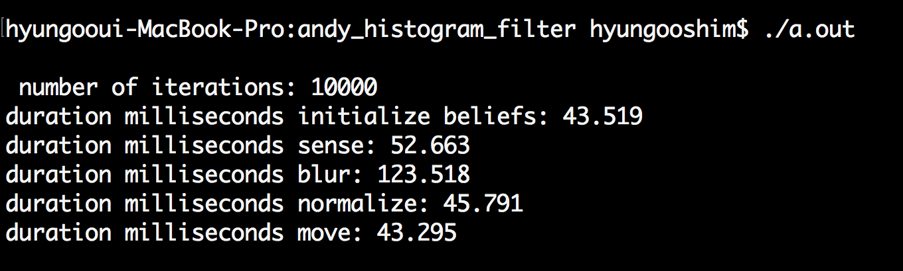

## Optimize C++ Histogram filter ##

In his code, you will find eight C++ files. Six of these files contain histogram filter functions. The other two are a main.cpp file and a file containing a function for printing out a matrix.

This optional project is to read through Andy's files, run the program, and then get his code to run faster.

And gcc can also optimize for execution time to get C++ code to run faster. The gcc compiler includes three levels of optimization, which you can use by adding the optimization flag to your compilation command: -O1 -O2 -O3

Here is command for compiling with level three optimization:
g++ -std=c++11 -O3 main.cpp blur.cpp initialize_beliefs.cpp move.cpp normalize.cpp print.cpp sense.cpp zeros.cpp

Below is compare Original code of andy who teach self driving car course in the Udacity and my optimize code...

** Andy's code **

